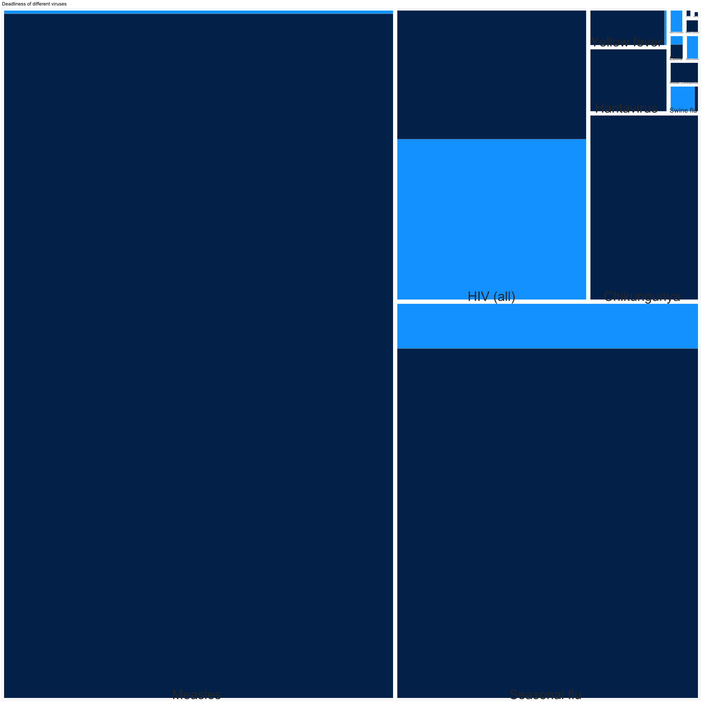

\#Data analysis: Why coronavirus fears are disproportionate

Comparing the new coronavirus with other viruses shows that panic,
especially outside of Wuhan, China, is out of place. The current
agitation has more to do with novelty and media attention than with real
danger.

In this repository, you will find the methodology, data and code behind
that story.

**Read the full article on DW.com:**
[English](https://www.dw.com/a-52281566)

**Story by:** [Kira Schacht](https://twitter.com/daten_drang)

\#Setup

``` r
## install and load needs, if not yet present
# install.packages("needs")
library(needs)

# packages used in this markdown document
needs(dwplot, tidyverse, treemapify)
```

*NOTE:* dwplot is the package we use to adapt our charts to DW style.
you can leave it out by commenting out the lines containing the
`theme_dw()` and `finalise_dwplot()` functions.

Read data
=========

For this project, we used the data from the
[MicrobeScope](https://informationisbeautiful.net/visualizations/the-microbescope-infectious-diseases-in-context/)
project, put together by David McCandless, Omid Kashan, Miriam Quick,
Karl Webster and Dr Stephanie Starling for [information is
beautiful](https://informationisbeautiful.net/). You can look at the
data behind the project
[here](https://docs.google.com/spreadsheets/d/1F9IMIeXHsfuQLN1HtgPvfHe2BjbWu0r0_Qt_BHOWjLs/).

We manually checked the sources they provided for all of the figures on
viruses we used in this story. In some cases, we made alterations, like
using a more recent year if available or adding numbers for one-time
outbreaks (like the outbreak of SARS in 2003). The results are in the
added columns `Incidence_clean` and `Fatal_clean`, which we used for
analysis.

``` r
#read data
d = read.csv2("MicrobeScope_2018.csv")

#only look at viruses
virus = d %>% filter(Pathogen_type == "virus")


#DW colours
dwcols = c("hellblau" = "#00A5FF", "mittelblau" = "#0064b4", "dunkelblau" = "#002d5a", "grey1" = "#f1f3f5")
dw_grey = c("grey14" = "#323c45", "grey13" = "#3b444d", "grey12" = "#4b545c", "grey11" = "#5c666e",
            "grey10" = "#6d7780", "grey9" = "#7f8891", "grey8" = "#9099a3", "grey7" = "#a1abb4", "grey6" = "#b2bcc5",
            "grey5" = "#bfc7ce", "grey4" = "#cbd2d8", "grey3" = "#d8dde2", "grey2" = "#e4e8eb", "grey1" = "#f1f3f5") %>% rev()
dw_info = c("hellblau" = "#00a5ff", "dunkelblau" = "#002d5a", "orangerot" = "#d44820",
            "grün" = "#96be00", "rot" = "#be232d", "gelb" = "#f0c80f")
dw_gradient = c("blau6" = "#002d5a", "blau5" = "#004887", "blau4" = "#0064b4",
                "blau3" = "#007acd", "blau2" = "#008fe6", "blau1" = "#00a5ff",
                "gelb" = "#f0c80f", "orangegelb" = "#f0aa00", "Hellorange" = "#ee8c0a",
                "Orange" = "#eb6e14", "Orangerot" = "#d44820", "rot" = "#be232d")
```

Incidence: Yearly cases of different viruses, barcode plot
==========================================================

Plot the case numbers (`Incidence_clean`) for each virus in a barcode
chart.

``` r
#data for plot: case numbers in millions, add sublabel to virus names.
d_plot = virus %>% mutate(Incidence_clean = Incidence_clean/10^6) %>% select(Name, Incidence_clean, Sublabel)

plot = ggplot(d_plot) +
    #Make hightlighted line for coronavirus
    geom_segment(data = d_plot %>% filter(Name == "Wuhan Coronavirus"),
                 aes(x=1, xend = 2, y = Incidence_clean, yend = Incidence_clean),
                 color = dw_info[1], size = 5, lineend = "round") +
    #Make grey lines for other viruses
    geom_segment(aes(x=1, xend = 2, y = Incidence_clean, yend = Incidence_clean),
                 color = dw_grey[12], size = 1, lineend = "round") +
    #Annotate the viruses with more than 10 million cases
    geom_text(aes(x = 2, y = Incidence_clean,
                  label = ifelse(Incidence_clean >= 10, as.character(Name), "")),
              size = 25, hjust = 0, nudge_x = 0.05) +
    #Set axis limits
    scale_x_continuous(limits = c(1, 3)) + 
    scale_y_continuous(expand = expand_scale(mult = c(0,.05))) + 
    ggtitle("New coronavirus cases are not on the\nsame scale as most common viruses") +
    #Theme settings
    theme_dw() +
    theme(axis.text.x = element_blank())
  
#Export plot as PNG and SVG
finalise_dwplot(plot, "Source: CDC, WHO, CIDRAP, studies, via The MicrobeScope", 
                "../../graphics/preliminary/cov_incidence.png", "png",
                width_pixels=1920, height_pixels= 2200)
```

    ## Warning: Removed 7 rows containing missing values (geom_segment).

    ## Warning: Removed 7 rows containing missing values (geom_text).

``` r
finalise_dwplot(plot, "Source: CDC, WHO, CIDRAP, studies, via The MicrobeScope", 
                "../../graphics/preliminary/cov_incidence.svg", "svg",
                width_pixels=1920, height_pixels= 2200)
```

    ## Warning: Removed 7 rows containing missing values (geom_segment).

    ## Warning: Removed 7 rows containing missing values (geom_text).


Death rates and fatalities of different viruses
===============================================

Plot the case numbers (`Incidence_clean`) and yearly fatalities
(`Fatal_raw`) for each virus in a tree map.

``` r
#data for plot:
d_plot = virus %>%
  mutate(Name = paste(Name, Sublabel) %>% as.character,
         #calculate number of non-fatal cases
         Non_fatal_clean = Incidence_clean - Fatal_clean) %>%
  #only look at viruses with less than 10 million and more than 100 cases
  #exclude "Rabies  (treated)": has the same numbers as untreated variation
  filter(Incidence_clean <= 10*10^6, Incidence_clean >= 100, Name != "Rabies  (treated)") %>% 
  select(Name, Fatal_clean, Non_fatal_clean) %>%
  gather(var, cases, 2:3)

#tree map
ggplot(d_plot, aes(area = cases, fill = var, subgroup = Name, label = Name)) +
  geom_treemap(layout = "squarified") +
  geom_treemap_subgroup_border(size = 15, colour = "white") +
  geom_treemap_subgroup_text(min.size = 1) +
  scale_fill_manual(values = dw_info[1:2] %>% unname) +
  guides(fill = FALSE) +
  ggtitle("Deadliness of different viruses")
```

    ## Warning: Removed 2 rows containing missing values (geom_treemap).

    ## Warning: Removed 2 rows containing missing values (geom_subgroup_border).

    ## Warning: Removed 2 rows containing missing values (geom_subgroup_text).



``` r
#Export plot as PNG and SVG
ggsave("../../graphics/preliminary/cov_deadliness.png", device = "png", width= 1920/72, height= 1920/72, dpi = 72, units="in")
```

    ## Warning: Removed 2 rows containing missing values (geom_treemap).

    ## Warning: Removed 2 rows containing missing values (geom_subgroup_border).

    ## Warning: Removed 2 rows containing missing values (geom_subgroup_text).

``` r
ggsave("../../graphics/preliminary/cov_deadliness.svg", device = "svg", width= 1920/72, height= 1920/72, dpi = 72, units="in")
```

    ## Warning: Removed 2 rows containing missing values (geom_treemap).

    ## Warning: Removed 2 rows containing missing values (geom_subgroup_border).

    ## Warning: Removed 2 rows containing missing values (geom_subgroup_text).

Death rates and fatalities of different viruses
===============================================

Plot the deadliness (`CFR_adult`) vs contagiousnesss (`R0`) for each
virus in a scatter plot.

``` r
#data for plot: case numbers in millions, add sublabel to virus names.
d_plot = virus %>% select(Name, Sublabel, CFR_adult, R0, Incidence_clean) %>% filter(!is.na(Incidence_clean)) %>% 
  mutate(Name = paste(Name, Sublabel) %>% as.character)

#scatter plot
plot = ggplot(d_plot, aes(x = R0, y = CFR_adult, label = Name)) + geom_point(colour = dw_info[2], size = 15) +
  geom_point(data = d_plot %>% filter(Name == "Wuhan Coronavirus "), colour = dw_info[1], size = 15) +
  geom_text(size = 25, hjust = 0, check_overlap = T, nudge_x = 0.3) +
  scale_y_continuous(expand = expand_scale(mult = c(0,.05)), labels = scales::percent_format(accuracy = 1)) +
  scale_x_continuous(limits = c(0,15)) +
  scale_size_continuous(range = c(10, 70)) + guides(size = FALSE) +
  ggtitle("Deadliness vs contagiousness of viruses") + theme_dw()

#Export plot as PNG and SVG
finalise_dwplot(plot, "Source: CDC, WHO, CIDRAP, studies", 
                "../../graphics/preliminary/cov_contagiousness.png", "png")
finalise_dwplot(plot, "Source: CDC, WHO, CIDRAP, studies", 
                "../../graphics/preliminary/cov_contagiousness.svg", "svg")
```


